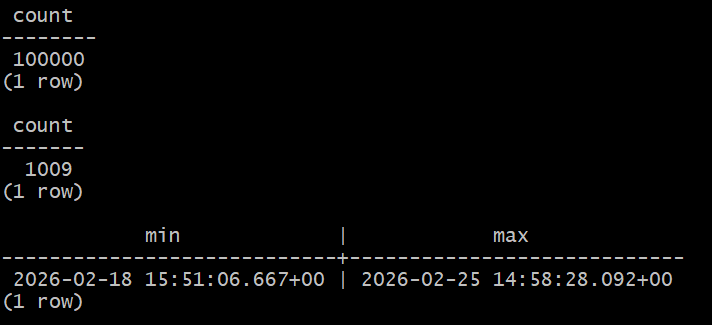
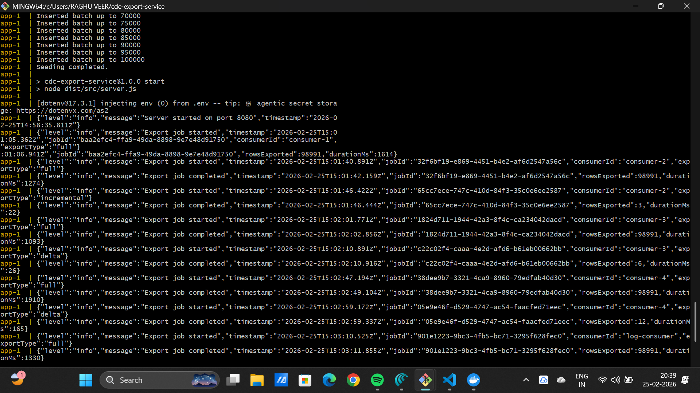
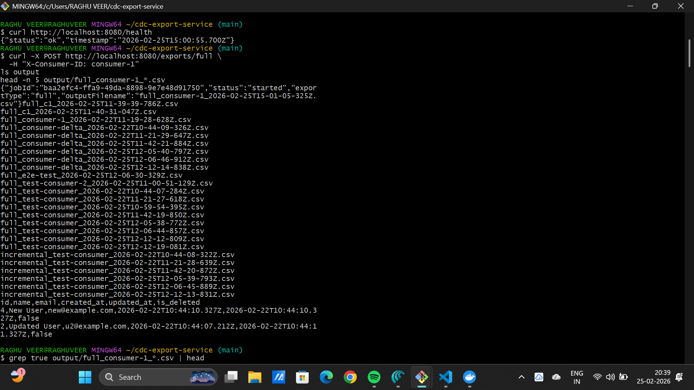
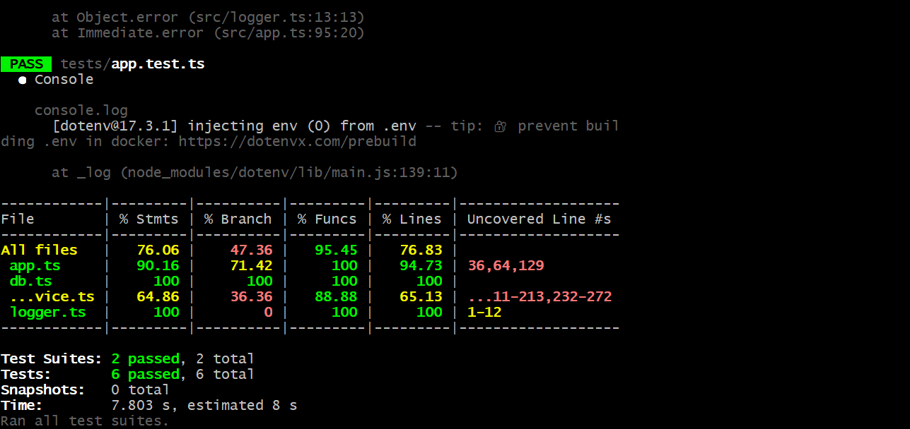
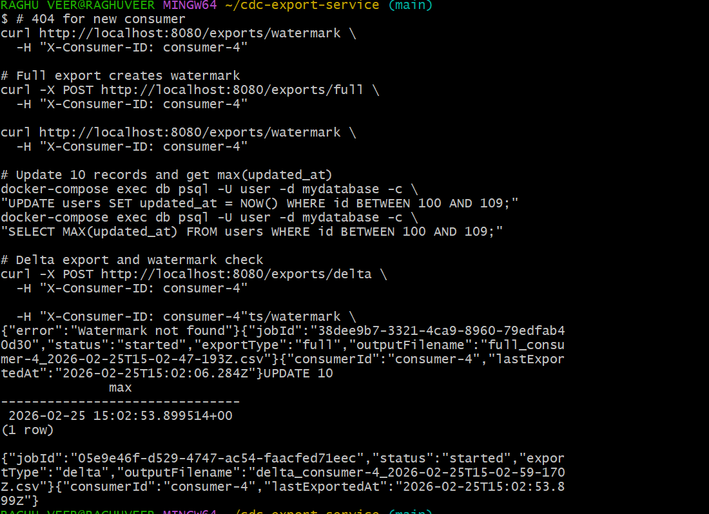

# CDC Export Service (Concise)

This README is a concise reference for running, testing, and verifying the CDC Export Service. It includes quick start steps, minimal API examples, a screenshot section (using images from `docs/`), and a video demo link.

---

## Quick Start (Docker)

1. Copy env and review:

```bash
cp .env.example .env
# edit .env if you need custom values
```

2. Build and start services (rebuild to pick up local changes):

```bash
npm run build && docker-compose down -v && docker-compose up -d --build
```

3. Wait for DB to seed (30s typical), then verify health:

```bash
curl -H "X-Consumer-ID: test" http://localhost:8080/health
```

---

## Minimal API Usage

- Health: `GET /health`
- Full export: `POST /exports/full` (header: `X-Consumer-ID`)
- Incremental: `POST /exports/incremental` (header: `X-Consumer-ID`)
- Delta export: `POST /exports/delta` (header: `X-Consumer-ID`)
- Watermark: `GET /exports/watermark` (header: `X-Consumer-ID`)

Example (full export):

```bash
curl -X POST -H "X-Consumer-ID: e2e-test" http://localhost:8080/exports/full
```

---

## Testing

Run tests inside the container (recommended):

```bash
docker-compose exec -T app npm test
docker-compose exec -T app npm run test:coverage
```

Local test (if dependencies installed):

```bash
npm test
```

Notes:
- Tests exercise normal and error paths. Seeing JSON error logs during some tests is expected — those tests validate error handling and logging.

---

## Screenshots

Screenshots live in `docs/`:

- Health view: `docs/image.png`
  
- Full export response: `docs/image1.png`
  
- Incremental export: `docs/image2.png`
  
- Delta export: `docs/image3.png`
  
- Output files: `docs/image4.png`
  


---

## Video Demo

[WATCH NOW--->>>](https://youtu.be/htoHSjGpcbY?si=Vd3kbeVKRmRVj6H1)

Or place `docs/demo.mp4` and host it with your docs.

---

## Files & Short Structure

- `src/` — TypeScript source
- `tests/` — Jest tests
- `seeds/` — DB seeding scripts
- `Dockerfile`, `docker-compose.yml`
- `output/` — CSV export files

---


```bash
# Inside the container
docker-compose exec app npm run test:coverage

# Or locally
npm run test:coverage
```

**Coverage Target**: Minimum 70% of codebase

View the HTML coverage report:
```bash
# After running coverage
open coverage/lcov-report/index.html
```

### Test Structure

- **Unit Tests**: API endpoints, configuration, utilities
- **Integration Tests**: Export workflows, watermark management, database interactions

Test files are located in the `tests/` directory:
- `tests/app.test.ts`: API endpoint tests
- `tests/export.test.ts`: Export flow and watermark tests

### Running Specific Tests

```bash
# Run only app tests
npm test -- app.test.ts

# Run only export tests
npm test -- export.test.ts

# Run with verbose output
npm test -- --verbose

# Watch mode (re-run on file changes)
npm test -- --watch
```

### Database State in Tests

Tests reset the database before running:
- Truncates watermarks table
- Truncates users table
- Reseeds with test data

This ensures test isolation and repeatability.

---

## Configuration

### Environment Variables

All environment variables are documented in `.env.example`:

```bash
# Application Settings
PORT=8080                    # API server port
NODE_ENV=development        # development, test, or production

# Database Connection
DATABASE_URL=postgresql://user:password@db:5432/mydatabase

# Export Settings
EXPORT_OUTPUT_DIR=./output  # Directory for CSV exports
```

### Configuration File

Configuration is loaded from `config/index.ts`:

```typescript
export interface Config {
  port: number;
  databaseUrl: string;
  exportOutputDir: string;
  nodeEnv: string;
}
```

Values are read from environment variables with sensible defaults. Update `config/index.ts` to add new configuration options.

---

## Logging

The system produces structured JSON logs for all key events:

### Log Events

1. **Export Started**
   ```json
   {
     "level": "info",
     "message": "Export job started",
     "timestamp": "2025-02-25T12:00:00.000Z",
     "jobId": "550e8400-e29b-41d4-a716-446655440000",
     "consumerId": "consumer-1",
     "exportType": "full"
   }
   ```

2. **Export Completed**
   ```json
   {
     "level": "info",
     "message": "Export job completed",
     "timestamp": "2025-02-25T12:00:05.000Z",
     "jobId": "550e8400-e29b-41d4-a716-446655440000",
     "rowsExported": 100000,
     "durationMs": 5234
   }
   ```

3. **Export Failed**
   ```json
   {
     "level": "error",
     "message": "Export job failed",
     "timestamp": "2025-02-25T12:00:10.000Z",
     "jobId": "550e8400-e29b-41d4-a716-446655440000",
     "error": "Connection pool exhausted"
   }
   ```

### Viewing Logs

```bash
# View all logs
docker-compose logs app

# Follow logs in real-time
docker-compose logs -f app

# View only error logs
docker-compose logs app | grep error
```

---

## Deployment

### Docker Compose (Production-Ready)

The included `docker-compose.yml` is production-ready:

```bash
# Start all services
docker-compose up -d

# Stop services
docker-compose down

# View logs
docker-compose logs -f

# Remove volumes (warning: deletes data)
docker-compose down -v
```

### Docker Build Strategy

The `Dockerfile` uses **multi-stage builds** for efficiency:

**Stage 1 - Build**:
- Installs all dependencies
- Compiles TypeScript to JavaScript

**Stage 2 - Production**:
- Copies only production dependencies
- Copies compiled JavaScript
- Reduces final image size ~40%

### Environment-Specific Deployment

1. **Development** (`NODE_ENV=development`):
   ```bash
   npm run dev
   ```
   - TypeScript source in memory (ts-node-dev)
   - Hot reload enabled
   - Detailed error messages

2. **Production** (`NODE_ENV=production`):
   ```bash
   npm run build
   npm start
   ```
   - Pre-compiled JavaScript
   - Optimized for performance
   - Minimal startup time

### Scaling Considerations

For extreme scenarios (billions of rows):

1. **Offload Export Jobs**: Move exports to a separate worker service using message queues (RabbitMQ, SQS)
2. **Partition Data**: Shard users table by consumer_id or date range
3. **Optimize Queries**: Add more specific indexes based on access patterns
4. **Pagination**: For very large incremental exports, implement pagination with cursors

---

## Development Workflow

### Building from Source

```bash
# Install dependencies
npm install

# Build TypeScript
npm run build

# Output goes to ./dist directory
```

### Development Server

```bash
npm run dev
```

Server starts on http://localhost:8080 with hot reload. Changes automatically recompile.

### Database Management

```bash
# Seed database (development)
npm run seed:dev

# Seed database (from compiled JS)
npm run seed
```

### Code Quality

```bash
# Check TypeScript compilation
npm run build

# Run tests with coverage
npm run test:coverage
```

---

## Troubleshooting

### Container fails to start

1. **Database connection error**:
   ```
   Error: connect ECONNREFUSED 127.0.0.1:5432
   ```
   - Ensure `depends_on` has `service_healthy` condition
   - Wait 30+ seconds for database to initialize
   - Check `docker-compose logs db`

2. **Build errors**:
   ```bash
   # Rebuild from scratch
   docker-compose down
   docker volume rm cdc-export-service_db_data
   docker-compose up --build
   ```

### Exports not being created

1. Check if output directory exists and is writable
2. Verify database has connected successfully
3. Monitor logs: `docker-compose logs -f app`
4. Ensure consumer has run at least one full export to establish watermark

### Performance issues

1. Increase database connection pool
2. Add index on `watermarks(consumer_id)` (already done)
3. Verify the `users(updated_at)` index exists
4. For >10GB datasets, consider partitioning

### Test failures

```bash
# Reset database and retry
docker-compose down -v
docker-compose up --build
npm test
```

---

## File Structure

```
cdc-export-service/
├── src/
│   ├── app.ts              # Express application setup
│   ├── server.ts           # Server entry point
│   ├── db.ts               # Database pool management
│   ├── exportService.ts    # Core export logic
│   ├── logger.ts           # JSON structured logging
│   └── types.ts            # TypeScript interfaces
├── config/
│   └── index.ts            # Configuration management
├── seeds/
│   ├── init.sql            # Schema initialization
│   └── seed.ts             # Data seeding script
├── tests/
│   ├── app.test.ts         # API endpoint tests
│   └── export.test.ts      # Export workflow tests
├── dist/                   # Compiled JavaScript (generated)
├── coverage/               # Test coverage reports (generated)
├── output/                 # CSV export files (generated)
├── package.json            # Dependencies and scripts
├── tsconfig.json           # TypeScript configuration
├── jest.setup.ts           # Jest test setup
├── jest.setup.js           # Jest setup (legacy, can be removed)
├── docker-compose.yml      # Multi-container orchestration
├── Dockerfile              # Application container image
├── .env.example            # Environment variables template
├── .gitignore              # Git ignore rules
└── README.md               # This file

```

